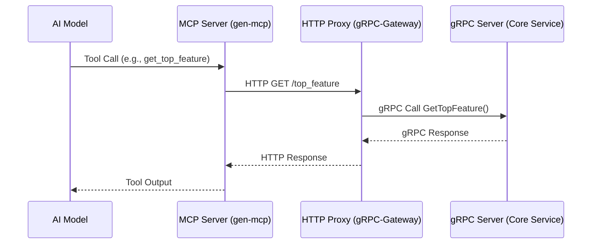

# Exposing gRPC Services to LLMs with the Model-Context Protocol (MCP)

This project demonstrates a complete, end-to-end pattern for exposing an existing gRPC service to Large Language Models (LLMs) as a set of callable tools.

The core challenge addressed is bridging the gap between binary, strongly-typed gRPC interfaces and the JSON-based tool-use APIs expected by modern AI models. 

This is achieved by using [gRPC-Gateway](https://github.com/grpc-ecosystem/grpc-gateway) to create a RESTful HTTP/JSON proxy for the gRPC service, and then using [gen-mcp](https://github.com/genmcp/gen-mcp) to expose that HTTP API to AI models via the Model-Context Protocol.

The key objective is to show that you can make a gRPC service available to an AI **without modifying the original service's code**. The only requirement is access to the service's `.proto` definition files.

While we're using [gen-mcp](https://github.com/genmcp/gen-mcp) to expose the HTTP proxy as MCP, you can use your own MCP solution to achieve the same.

## Motivation: Why This Approach?

The ultimate goal is to allow AI models to call gRPC services directly through the Model-Context Protocol. However, adding native gRPC support to a tool like `gen-mcp` is complex. As discussed in [this `gen-mcp` issue](https://github.com/genmcp/gen-mcp/issues/145), challenges include:

- **Protocol Mismatch**: LLMs interact with tools via JSON, whereas gRPC uses the binary Protocol Buffers format. A translation layer is required.
- **Schema Representation**: How do you define gRPC messages, services, and data types within a YAML `mcpfile` in a way that is both comprehensive and user-friendly?
- **Dynamic Invocation**: Calling gRPC services dynamically without pre-generating client stubs requires mechanisms like gRPC reflection or manual handling of protoset files, each with its own trade-offs in performance and complexity.

While native support is a long-term goal, this demo presents a robust, production-ready pattern to unblock developers **today**.

By converting the gRPC service into a standard OpenAPI-compliant REST API using gRPC-Gateway, we transform the problem into one that `gen-mcp` already solves elegantly. This layered approach provides a stable and immediate solution for integrating existing gRPC infrastructure with AI models.

## Technology Stack

*   **Go**: The language used for both the gRPC server and the HTTP proxy.
*   **gRPC**: The primary RPC framework for the core service.
*   **Protocol Buffers**: The interface definition language for the gRPC service.
*   **gRPC-Gateway**: The tool used to generate the reverse proxy that translates HTTP/JSON to gRPC.
*   **gen-mcp**: A tool for exposing APIs to AI models using the Model-Context Protocol.

## Architecture

The demo consists of three independent services that run simultaneously:

1.  **gRPC Server**: The original, "untouchable" service.
2.  **HTTP Proxy**: The gRPC-Gateway server that exposes a RESTful API.
3.  **MCP Server**: The `gen-mcp` server that exposes the RESTful API as tools for AI.

The flow of a request from an AI model to the core gRPC service is as follows:

## Project Structure

This repository is split into distinct parts to simulate a real-world scenario where the gRPC service might be maintained by a different team or exist as a legacy component.

-   `000_grpc_server/`: A standalone gRPC service for managing feature requests. This represents the existing service that we don't want to (or can't) modify.
-   `001_grpc_proxy/`: An HTTP/JSON proxy that translates RESTful API calls into gRPC requests and forwards them to the gRPC service.
-   `002_genmcp_grpc/`: Contains the configuration to expose the HTTP proxy endpoints as tools for AI models using `gen-mcp`.

## Getting Started

To run the full demo, you will need to start the gRPC server, the HTTP proxy, and finally the `gen-mcp` server in separate terminal sessions.

1.  **Start the gRPC Server:**
    *   Navigate to the `000_grpc_server` directory.
    *   Follow the instructions in `000_grpc_server/README.md`.

2.  **Start the HTTP Proxy:**
    *   Navigate to the `001_grpc_proxy` directory.
    *   Follow the instructions in `001_grpc_proxy/README.md`.

3.  **Expose the Service with gen-mcp:**
    *   Navigate to the `002_genmcp_grpc` directory.
    *   Follow the instructions in `002_genmcp_grpc/README.md`.

Once all three services are running, you can make gRPC calls to port `50051`, RESTful API calls to port `9090`, and MCP tool calls to port `8080` at http://localhost:8080/mcp.
